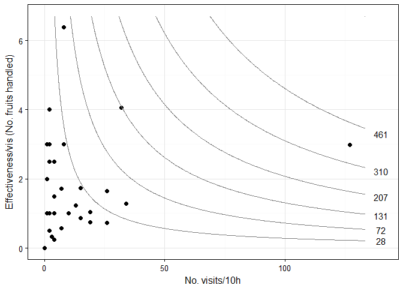
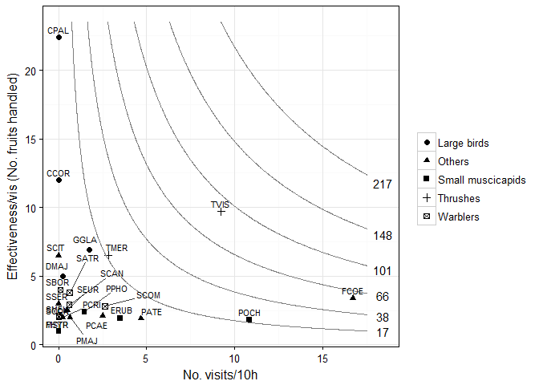

The effectiveness package
=========================

[](https://zenodo.org/badge/latestdoi/84199078)

This is `effect.lndscp`, an `R` package for plotting the effectiveness landscape of mutualisms adding isolines of equal effectiveness values.

Effectiveness landscapes are the two-dimensional representation of the possible combinations of the quantity and the quality of mutualistic services (seed dispersal, pollination) and with elevational contours representing isoclines of effectiveness. These representations can be 2D bivariate plots of multiplicative effects of any of the seed dispersal (SDE) or pollination (PE) effectiveness components.

Installation
------------

``` r
devtools::install_github("pedroj/effectiveness_pckg")
```

Usage
-----

``` r
library(effect.lndscp)
```

Based on a dataset of *Cecropia glaziovii* frugivores. In this example we build the effectiveness landscape just for the quantitative component, plotting its two subcomponents, visitation rate and per-visit effectiveness.

``` r
data(cecropia)
effectiveness_plot(cecropia$totvis, cecropia$totbic, 
    myxlab = "No. visits/10h", 
    myylab = "Effectiveness/vis (No. fruits handled)")
```



Based on a dataset of *Prunus mahaleb* frugivores.

``` r
data(prunus)
effectiveness_plot(prunus$visits, prunus$eff_per_vis, 
   pts.shape = prunus$group, label = prunus$animal,  
   myxlab = "No. visits/10h", 
   myylab = "Effectiveness/vis (No. fruits handled)")
```



For additional details please visit the web page [here](http://pedroj.github.com/effectiveness/).

**References**
Schupp, E.W., Jordano, P. & Gómez, J.M. (2017). A general framework for effectiveness concepts in mutualisms. *Ecology Letters*, **20**, 577–590. In press. **doi**: 10.1111/ele.12764
Schupp, E.W., Jordano, P. & Gómez, J.M. (2010) Seed dispersal effectiveness revisited: A conceptual review. *New Phytologist*, **188**, 333–353.
Schupp, E.W. (1993) Quantity, quality and the effectiveness of seed dispersal by animals. In: *Frugivory and seed dispersal: ecological and evolutionary aspects* (eds T.H. Fleming & A. Estrada), pp. 15–29. Springer, Dordrecht; The Netherlands.
Jordano, P. & Schupp, E.W. (2000) Seed disperser effectiveness: The quantity component and patterns of seed rain for *Prunus mahaleb*. *Ecological Monographs*, **70**, 591–615.
